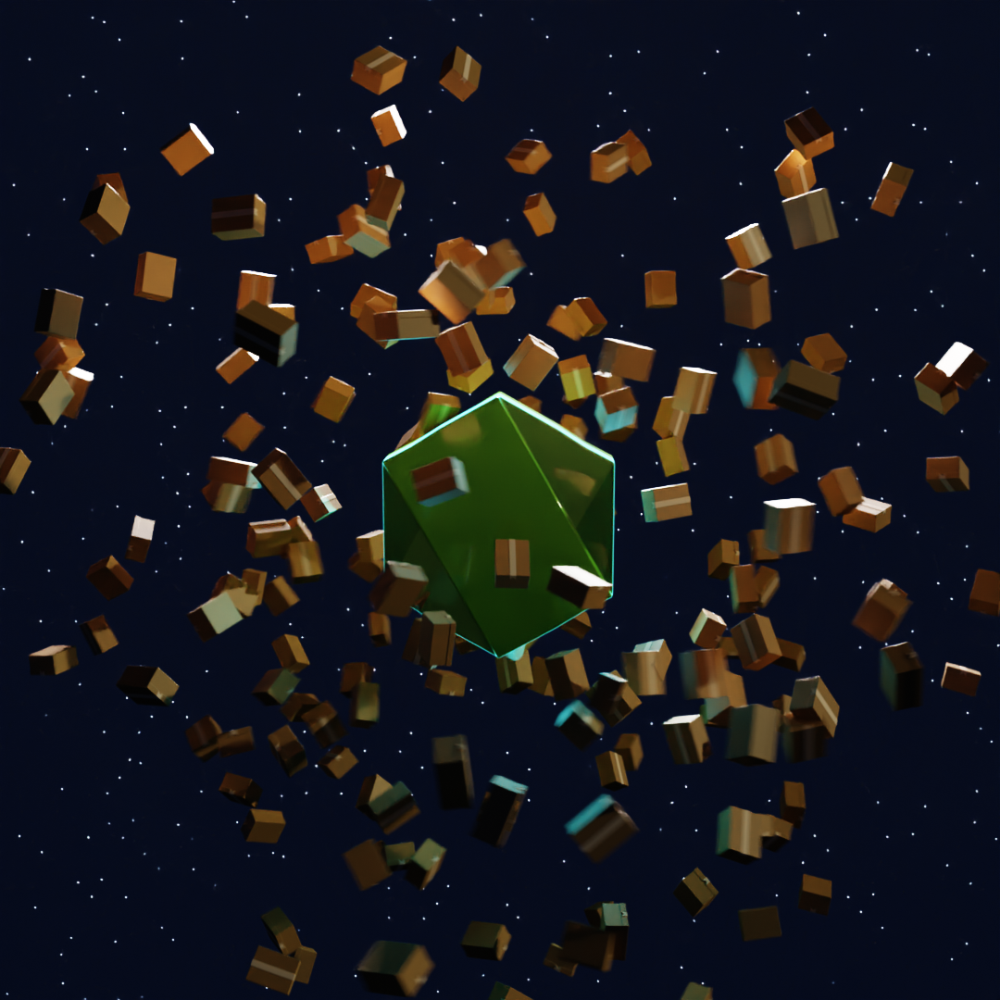
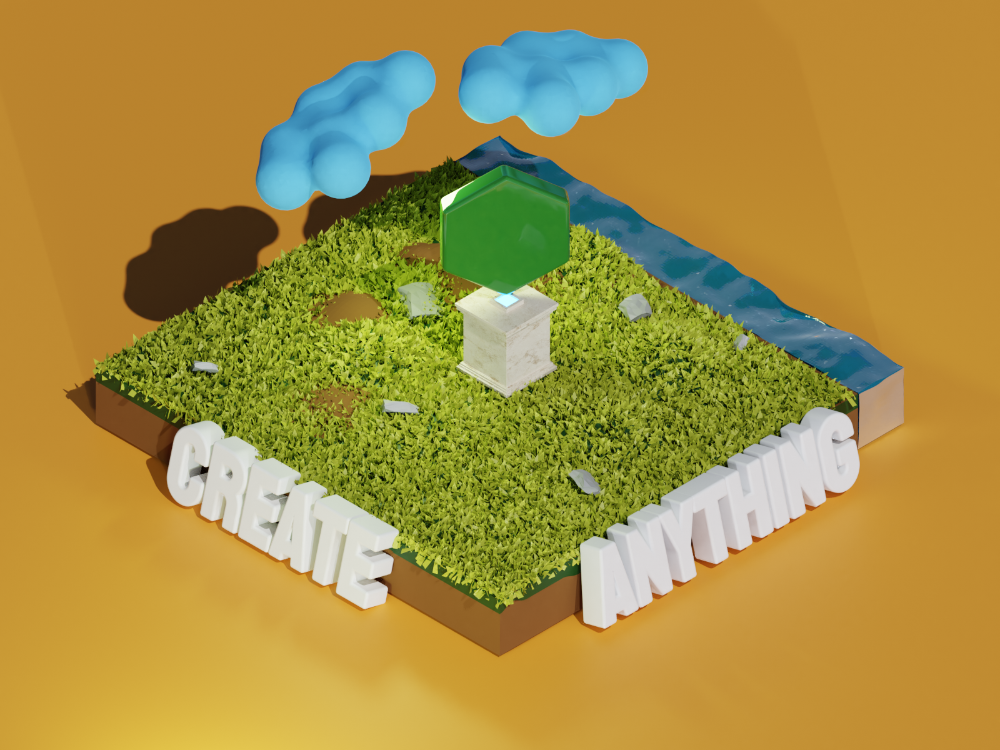

# 3D Illustrations of the Node Logo

Illustrations of the Node Logo done in Blender (2.8/2.9).All textures and fonts are included.

## Version 2

Includes:

- [4K Version](./version2/render_4k.png)
- [1080P Version](./version2/render_1080.png)
- [Animation in 1080\*1080](./version2/node_video.mp4)
- [Blender File](./version2/node.blend)

No textures were used in this version

## Version 1

Includes:

- [4K Version](./version1/node-4k.png)
- [Small Version](./version1/node-final-small.png)

Textures are all from https://hdrihaven.com/ and https://cc0textures.com/ that both have Creative Commons license.

Font from: https://fonts.google.com/specimen/Staatliches#license

## License

This work was done for @bnb.

All images and blender files are under the Creative Commons license
